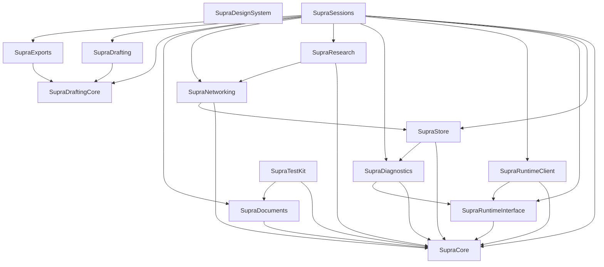
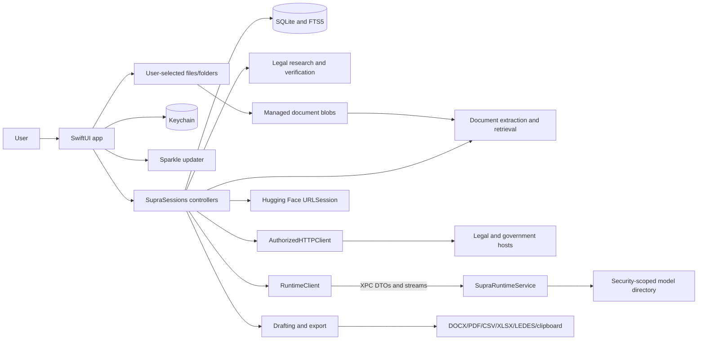

# Architecture and trust boundaries

## Current repository structure

The repository contains two Xcode targets and 14 local Swift packages, not the 11 stated in `AGENTS.md`.

- `Apps/SupraAI/SupraAI`: SwiftUI application and composition root
- `Apps/SupraAI/SupraRuntimeService`: sandboxed MLX XPC service
- `website`: Next.js static website and appcast
- `Scripts`: release, model-ID, and public-font verification
- `TestData`: synthetic corpus and specifications
- `Docs`: architecture, milestone, and process claims

### Local package graph

`SupraSessions` is the app-facing orchestration hub and the largest concentration of cross-domain behavior. `SupraStore` is the only production owner that creates GRDB `DatabaseQueue` instances. `SupraNetworking` deliberately depends on `SupraStore` to persist request logs.

## Main runtime flows

## Trust-boundary table

| Boundary | Inputs and outputs | Authentication / authorization | Validation and safety | Persistence / cleanup | Principal risk |
|---|---|---|---|---|---|
| SwiftUI app process | User text, files, UI actions; rendered outputs | macOS user and app sandbox | Controller validation varies; safety state often advisory | SQLite, files, preferences | UI can expose an artifact even when a controller calls it blocked |
| XPC runtime service | Codable model requests, bookmarks/raw path, token stream | Embedded service connection; listener accepts every connection it receives | DTO decoding, single-generation controls; no explicit audit-token allow check | Model held in service memory; cancellation on connection loss | Real signed runtime/client validation and raw-path behavior were not exercised |
| Model-weight access | Security-scoped bookmark plus path | App-scoped bookmark; XPC sandbox | Bookmark resolution; raw-path fallback when bookmark absent | Managed model directory; nonzero files treated as complete | Corrupt/truncated checkpoint trusted; stale bookmark recovery gaps |
| User-selected source files | Hostile filenames and bytes | Shipping entitlement is user-selected read-write | Extension dispatch; no general magic/MIME check; symlinks not rejected | Copied blob plus extracted/indexed text | TOCTOU, hostile parser, symlink traversal, source/managed mismatch |
| Managed document storage | Content-addressed copies | App container/user permissions | SHA before copy; no atomic temp/rename or post-copy hash | Plain files; orphan cleanup on permanent delete | Partial/corrupt existing blob accepted; default filesystem modes |
| SQLite/FTS | Matter, chats, research, documents, billing, logs | App process only by architecture | GRDB migrations and foreign keys; repositories generally scoped | Plain SQLite, snapshots and user backups | Shipping migration fixtures absent; fallback store behavior needs operational testing |
| Keychain | CourtListener and optional connector keys | macOS Keychain | This-device-only accessibility; header/query redaction | Keychain delete/update | Environment fallback contradicts Keychain-only claims |
| Legal/government HTTP | User-approved search terms; public results | Host-specific keys or token-free | Initial URL policy, exact host, HTTPS, rate limits | Path/metadata logs; caches | Redirect destination not revalidated |
| CourtListener storage CDN | Opinion PDF | Explicit unauthenticated send | Token host gate prevents initial CDN token use | Downloaded opinion | Redirect containment still absent |
| Hugging Face | Repo IDs, file metadata, model bytes | Public HTTPS | Initial hostname only; `URLSession` redirects; compatibility checks | Managed model folder | Integrity/resume and redirect exceptions are weaker than documented policy |
| Sparkle update service | Automatic appcast and update download | EdDSA update signing, notarized app | Separate Sparkle network stack | Cached update and installed app | Scheduled background egress contradicts user-initiated/every-request claims |
| Document extraction/OCR | PDF, images, Office ZIP/XML, EML | Local file grant | Office entry size cap exists; parser coverage varies | Parts, chunks, embeddings | Whole-file/nested email allocation and extension-only routing |
| Legal verification | Generated answer plus source packet | None; local deterministic checks | Label, quote, jurisdiction, and limited overlap checks | Answer, verification state, sources | Short authority and label-only paths can falsely pass |
| Drafting/export | Slots, model prose, style/template | User initiation | Deterministic render; demand-letter prose scan occurs after render | Files in managed export directory | Blocking content persists and remains shareable; writes are non-atomic |
| ScratchPad/billing | Day entries, attachments, all matter metadata, model JSON | User initiation and review | `#Note` pre-filter; UTBMS/date repair | Draft versions and exports | All-matter prompt and unvalidated evidence-to-matter association |
| Logs/diagnostics/audit | Request metadata, status, errors | Local app | Headers/keys redacted; stable unsalted query fingerprints | SQLite and exported diagnostics | Offline dictionary/correlation risk; audit writes often best-effort |
| Clipboard/Quick Look/Finder | Exported or copied legal/billing content | User action | Depends on upstream warnings | Outside app control after action | Advisory state cannot follow content after export |
| Public website/releases | Claims, appcast, DMG/ZIP | GitHub/Pages, Developer ID, notarization, Sparkle signature | Website build and font guard; release script lacks full test gates | Public, durable distribution | Hidden PR refs still distribute prohibited assets; claims drift from code |

## Sensitive-data locations

- SQLite tables and FTS indexes
- managed document blobs, previews, exports, and temporary paths
- embedding vectors and source excerpts
- local model prompts and in-memory XPC buffers
- Keychain values and optional process environment
- request logs containing host/path and stable query fingerprints
- diagnostics, audit events, backups, exported files, clipboard, and system recent-file surfaces

The database and managed document files are not application-encrypted. They depend on sandbox/container access, the macOS user account, and optional FileVault for protection at rest.

## Attack surface summary

The highest-value attack surfaces are hostile imported files and prompt content, redirect-capable network endpoints, model repository metadata/files, untrusted model output crossing into legal or billing records, XPC DTO/bookmark handling, migration and fallback-store behavior, and the public release/website supply chain.
