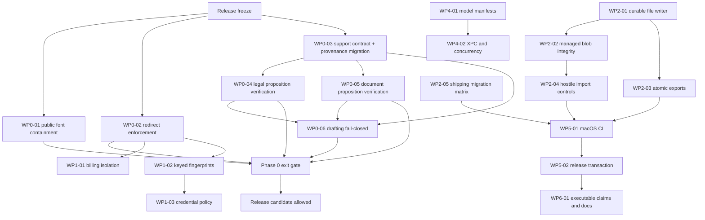

# Remediation implementation roadmap

## 0. Purpose, baseline, and execution contract

This is the implementation plan for SA-ACR-001 through SA-ACR-015. It expands the review findings into ordered work packages with fixed invariants, exact code/test surfaces, merge gates, migration behavior, and release criteria.

The reviewed baseline is `main` at `24a802cb0ab763a225982813a7b1c374864bbdeb`, with migrations through v054, 14 local Swift packages, app version 2.2.0, and the latest published app artifact at build 386. Before starting the first branch, fetch `origin`, record the new baseline SHA in the private progress ledger, and renumber any planned migration if `main` has advanced. Do not weaken an invariant merely to accommodate intervening code.

Per `AGENTS.md` and `Docs/Test-First-Methodology.md`, this roadmap is a working planning artifact. Keep it out of production commits unless the repository owner expressly chooses to retain the review package. What lands in implementation PRs is the RED test commit, the implementation, and durable product/security documentation.

### Program outcome

The program is complete only when all of the following are true:

1. No prohibited Equity font path or known prohibited blob is reachable through any public branch, tag, pull-request ref, release, Pages artifact, or current repository artifact.
2. A legal or document proposition is never labeled clean merely because its citation label exists. Every proposition is `supported`, `unsupported`, or `unverifiable`; only `supported` is clean.
3. A blocked drafting result is rejected before rendering, persistence, audit success, Open, Reveal, Share, clipboard, print, or export.
4. Every network redirect hop is authorized before transmission, with explicit credential scope and a typed, logged failure for rejected hops.
5. Billing prompts and persisted lines can reference only evidence-reachable matters and valid included source entries.
6. Managed blobs, exports, drafts, and model files are written atomically and verified before the database or UI reports success.
7. Every supported shipping database migrates in CI with integrity, foreign-key, FTS, orphan, idempotency, and recovery assertions.
8. PR and release gates build and test Swift, validate security controls, and bind every release artifact to an exact commit and preflight manifest.
9. Public and internal claims describe the implemented behavior without absolutes that the code does not enforce.

### Non-negotiable constraints

- Keep the release freeze in place until the Phase 0 exit gate passes.
- Use synthetic fixtures only. Never place client data, credentials, model weights, restricted font binaries, or generated client-like content in commits or CI artifacts.
- Never download, attach, or recirculate the prohibited fonts while resolving SA-ACR-001. Path/tree/blob metadata is sufficient.
- Preserve package boundaries: only `SupraStore` opens SQLite; networking and Keychain stay in `SupraNetworking`; document parsing remains network-free; MLX remains in the XPC service.
- Do not add a global network-policy bypass, disable sandboxing, suppress warnings, auto-accept unverifiable legal output, or make best-effort logging substitute for a security decision.
- Migrations are additive and forward-only. A failed migration must preserve the original database and a verified pre-migration snapshot.

## 1. Ownership and decision gates

One person may hold several roles, but each approval must be recorded separately in the private progress ledger.

| Role | Accountable scope |
|---|---|
| Release owner | Release freeze, GitHub Support, public-ref verification, branch protection, signed release transaction |
| Security/network owner | Redirect enforcement, credential scope, Keychain, diagnostic fingerprints, entitlements |
| Legal-verification owner | Proposition model, legal hydration, quarantine behavior, attorney corpus |
| Attorney reviewer | Meaning of supported/unverifiable, acceptable pinpoint evidence, legal regression corpus |
| Documents owner | Prompt isolation, document support, import policy, managed blobs, document exports |
| Drafting owner | Structured letter output, fact provenance, pre-render gates, blocked-artifact UX |
| Billing owner | Candidate-matter derivation, evidence graph, unassigned workflow, CSV behavior |
| Persistence owner | New migrations, historical fixtures, snapshot/recovery, integrity reconciliation |
| Runtime owner | Model manifests, XPC lifecycle, Swift concurrency, sanitizer/resource gates |
| Product/UX owner | Blocked-draft behavior, user notices, repair/reassignment flows, accessibility |

The following decisions block the named work package. The default is fail-closed if an approver does not choose an alternative.

| Decision | Required choice | Default if not otherwise approved | Approver | Blocks |
|---|---|---|---|---|
| D-01 | May a blocked demand letter exist as a review-only file? | No file is rendered or persisted | Product/UX + attorney reviewer | WP0-06 |
| D-02 | What qualifies as proposition support and an adequate pinpoint? | Exact retained excerpt plus conservative support decision; ambiguity is `unverifiable` | Attorney reviewer | WP0-03 through WP0-05 |
| D-03 | How are existing `complete` legal/document outputs handled? | Mark `needs_review`/`legacy_unverified`; never silently grandfather | Product/UX + persistence | WP0-03 |
| D-04 | How are unmentioned or multi-matter billing entries handled? | Persist as unassigned; require explicit user assignment; never infer from the global matter list | Product/UX + billing | WP1-01 |
| D-05 | What import resource limits are supported? | Product owner must approve numeric limits before GREEN; no unbounded fallback | Product/UX + documents | WP2-04 |
| D-06 | Which release lines are supported for migration? | v1.4.1, v1.5.2, v1.8.0, v2.0.0, v2.1.0, v2.1.3, v2.2.0, and latest-minus-one | Release + persistence | WP2-05, WP6-01 |
| D-07 | Are production API keys allowed from process environment? | Release builds use Keychain only; environment injection is DEBUG/test-only | Security owner | WP1-03 |
| D-08 | Where do protected macOS CI and signing run? | PR CI uses a trusted macOS runner without release secrets; signing/notarization runs only in a protected release environment | Release + security | WP5-01, WP5-02 |
| D-09 | How is the embedded XPC client authenticated? | Prototype Team ID/designated-requirement validation; if platform APIs are unsuitable, document the private-service boundary and retain a signed integration gate | Security + runtime | WP4-02 |

No implementation PR may leave one of these decisions unresolved. The decision, approver, date, and affected test IDs must be written into the private SPEC/PLAN/TESTPLAN before the RED commit.

## 2. Dependency and release-critical path



WP0-01 is externally blocked until GitHub Support completes server-side cleanup, but code work on WP0-02 through WP0-06 may proceed in parallel. A public release may not proceed around WP0-01.

## 3. Delivery discipline for every work package

### Branch, commit, and PR rules

1. Branch from freshly fetched `main` using `fix/acr-<id>-<slug>`, `test/acr-<id>-<slug>`, or `chore/acr-<id>-<slug>`.
2. Write the private SPEC/PLAN/TESTPLAN and assign stable test IDs before production code.
3. Commit gating tests first. The commit message must name the finding and expected RED reason, for example `Test ACR-NET-01: reject a redirect to a disallowed host (RED: request reaches second server)`.
4. Run the tests at that commit and record the exact failing assertion or compile error. An unobserved RED state blocks production implementation.
5. Commit implementation separately. Do not amend away the RED commit.
6. Run the touched package tests, the four static test-safeguard greps, and every listed integration gate. Record exact commands and results in the PR.
7. Keep each PR to one work package unless this roadmap explicitly joins them. A foundational type PR may merge first, but it must not weaken behavior while consumers are incomplete.
8. Update the findings CSV from `Open` only after the work package validation criteria pass on the protected branch. Use `Remediated` only after the merge gate; use `Mitigated` for partial containment and keep the finding open.

### Required test hygiene

Every new behavioral test must state its expected RED reason, use non-default canaries, assert the unsafe/default output is absent, avoid silent guards and unawaited work, and fail if an expected callback/transport/renderer was never invoked. Run these greps over touched tests before compilation:

```sh
rg -n 'XCTAssertFalse\(.*contains\("[^"]{1,6}"\)' <touched-test-paths>
rg -n 'guard .* else \{ return \}' <touched-test-paths>
rg -n '^\s*_ = try |^\s*try [a-z]' <touched-test-paths>
rg -n 'contains\(""\)' <touched-test-paths>
```

### Standard verification tiers

- **Tier A — PR-local:** touched package tests, static safeguard greps, `git diff --check`.
- **Tier B — cross-package:** every directly dependent package, Debug app/XPC build, relevant UI/integration target.
- **Tier C — phase gate:** all 14 package suites, Debug and Release builds with zero project-source warnings, three app UI tests plus new security/drafting smoke tests, website lint/typecheck/build, dependency/security checks, migration matrix, and public-font guards.
- **Tier D — release:** signed archive, real XPC/model smoke test, entitlements, hardened runtime, notarization/stapling/Gatekeeper, artifact-content scan, exact SHA/version/build manifest, draft-release/appcast transaction, and public-ref metadata scan.

### Phase control matrix

This matrix preserves the phase-level control contract. The work packages below are the authoritative implementation detail.

| Phase | Included findings | Required order | Dependencies | Principal implementation risks | Required regression proof | Phase acceptance | Data migration | Existing-user notice/recovery |
|---|---|---|---|---|---|---|---|---|
| 0 — containment/blockers | SA-ACR-001–005 | Public containment and redirect can run in parallel; support contract before legal/document verifiers; both before drafting gate | GitHub Support; D-01–D-03; attorney corpus | Public residue survives; redirect compatibility breaks; false-clean legal output; excessive false blocking; blocked file still leaks through a secondary UI | Public-ref metadata; redirect matrix; legal/document support and injection corpus; renderer/filesystem/audit/UI absence | All five blockers closed; Tier C green; attorney and release-owner sign-off | Yes: next migration adds verification provenance and marks legacy outputs review-required | Notice and reverify prior legal/document outputs and demand letters; no deletion |
| 1 — privilege/isolation | SA-ACR-005, SA-ACR-007, SA-ACR-014, SA-ACR-015 | Redirect first; billing scope and HMAC may follow in parallel; credential composition after HMAC/redirect | D-04, D-07; Keychain lifecycle | Legitimate multi-matter work becomes unassigned; lost diagnostics correlation; provider redirects/credentials break | Two-client billing canary; fabricated source IDs; HMAC cross-install; Release environment-key rejection | Evidence graph and credential scope enforced; no unkeyed fingerprint fallback | No required schema migration; version/clean existing network metadata if retained | Review existing multi-matter drafts; explain fingerprint rotation/cleanup |
| 2 — persistence/import | SA-ACR-006, SA-ACR-009, SA-ACR-011, SA-ACR-013 | Durable writer; managed blobs and exports; import controls after blob ingest; migration matrix before CI | D-05, D-06; fixture privacy review | Disk faults destroy prior files; reconciler finds legacy corruption; limits reject valid large matters; fixture drift | File fault injection; blob mutation/hash; old-export preservation; hostile import corpus; shipping upgrade matrix | Atomic verified files; bounded root-contained imports; all supported migrations/recovery pass | Yes: blob-integrity state; later migration numbers allocated from current main | Offer blob repair/reimport and migration recovery; preserve original/snapshot |
| 3 — legal/drafting/billing completion | SA-ACR-002, SA-ACR-003, SA-ACR-004, SA-ACR-007, SA-ACR-008 | Phase 0/1 behavior first; attorney calibration; CSV hardening; user revalidation | Attorney reviewer; D-03/D-04; export policy | Verifier tuning weakens fail-closed semantics; CSV compatibility; old outputs mislabeled | Shared attorney corpus; spreadsheet literal-cell smoke; upgrade/revalidation UI | Zero false-clean blocking-corpus cases; tabular exports literal; legacy state visible | Uses Phase 0 provenance migration; no additional schema required unless recovery state is persisted | Prominent revalidation notice and one-click reverify/regenerate/assign flows |
| 4 — model/XPC/reliability | SA-ACR-010 and reliability follow-ups to SA-ACR-011 | Model manifest before real model/XPC qualification; actor fix before zero-warning gate; sanitizers last | D-09; protected small model; signed host app | Hub metadata insufficient; forced redownload; unsupported client-auth API; flaky lifecycle tests | Corrupt/truncated model matrix; real signed XPC lifecycle; TSan/resource loops | Only revision-bound verified models load; zero actor warnings; 20 lifecycle loops pass | Filesystem manifest only; no DB migration planned | Notify and safely redownload legacy unmanifested models |
| 5 — CI/release | SA-ACR-001, SA-ACR-012, SA-ACR-013 and every finding's merge gate | macOS CI; deliberate-failure validation; release transaction; branch/tag protection | D-08; trusted runners; completed functional gates | CI cost/flakiness; secret exposure; partial public release/appcast; provenance drift | Test/package/font/secret/entitlement deliberate failures; release failure injection; public digest recheck | Protected CI required; SHA-bound preflight; transactional signed release | None | Publish provenance/checksums; documented release withdrawal path |
| 6 — claims/accessibility | SA-ACR-014 plus test/UX observations | Functional semantics final; executable facts; docs/website/UI; accessibility/test cleanup | D-06/D-07; all behavior-changing phases | Claims become stale or overbroad; warning relies on color; brittle UI tests | Claims script; docs/website build; VoiceOver/keyboard/high-contrast; no silent guards | Every claim version/test-linked; supported line current; remediated warnings accessible | None | Publish corrected privacy/security/support wording and dated change notice |

## 4. Phase 0: Immediate containment and release blockers

### WP0-01 — Remove public prohibited-font residue (SA-ACR-001)

**Owner:** Release owner. **Dependency:** GitHub Support. **Code surfaces:** `Scripts/verify-public-font-license.sh`, `Docs/Website-Asset-Licensing.md`, `.github/workflows/deploy-website.yml`; new `Scripts/verify-public-repository-assets.sh` and scheduled workflow.

**Execution:**

1. Keep the public release freeze active and preserve the current local/path/hash guard.
2. Continue the private GitHub Support sensitive-data request with refs 39–50, cached views, forks/caches where applicable, and server garbage collection. Supply identifiers and paths only; do not attach or download font files.
3. Add a metadata-only script that enumerates public branches, tags, advertised `refs/pull/*/head`, release asset names, and GitHub tree entries. It must reject prohibited paths and known deny-list object IDs without fetching blob contents.
4. Run that script as a scheduled/manual job immediately. It is expected to remain RED until Support completes cleanup. After the first clean unauthenticated run, make it a required release gate and retain the schedule for recurrence detection.
5. Extend the release artifact scan to inspect app/ZIP/DMG/Pages file lists and hashes before upload. The existing guard must run before and after website static export.

**RED tests:** a fixture tree containing a prohibited path; a renamed file with a known prohibited blob ID; synthetic `ls-remote`/tree API output containing a pull ref; a clean tree. Tests must not contain font bytes.

**Acceptance:** GitHub Support confirms scope; two unauthenticated checks at least 24 hours apart report zero prohibited paths/IDs across all public refs and cached raw views; repository, LFS, Pages, latest release, ZIP, and DMG scans pass. Until then the finding remains open and release-blocking.

### WP0-02 — Enforce policy and credential scope on every redirect hop (SA-ACR-005)

**Owner:** Security/network owner. **Dependencies:** connector redirect inventory; D-08 only for live integration. **Primary files:**

- `Packages/SupraNetworking/Sources/SupraNetworking/AuthorizedHTTPClient.swift`
- `Packages/SupraNetworking/Sources/SupraNetworking/NetworkPolicyService.swift`
- new `PolicyEnforcingURLSessionTransport.swift` and `RedirectPolicy.swift`
- `Packages/SupraSessions/Sources/SupraSessions/HuggingFaceClient.swift`
- `Packages/SupraNetworking/Tests/SupraNetworkingTests/RedirectPolicyTests.swift`

**Fixed contract:** HTTPS only; normalized exact host; no userinfo; port absent or explicitly approved; maximum five hops; same-origin redirects by default; cross-origin redirects require a named token-free service rule; credentials never cross service scope; every blocked hop returns a typed policy error and a redacted audit record.

**RED tests (`ACR-NET-*`):**

- Initial allowed host redirects to disallowed host and the second server receives zero requests.
- HTTP downgrade, userinfo, alternate port, redirect loop/sixth hop, protocol-relative location, 301/302/303/307/308, and allowed→allowed-but-wrong-credential-scope cases.
- `Authorization` remains only on explicitly approved same-service hops and is stripped on approved token-free cross-origin hops.
- A blocked redirect produces one typed failure and one blocked audit row naming the redacted destination; no successful completion row is written.
- Hugging Face integration captures real redirect hosts for a small metadata/config request and rejects any host outside its explicit token-free set.

**Implementation:**

1. Add a `RedirectPolicy` value describing initial service, allowed origins/ports, credential owner, and hop limit.
2. Add a dedicated `URLSession` transport with a task delegate. In `willPerformHTTPRedirection`, validate the proposed request before calling the completion handler. Store any violation by task identifier, return no redirected request, and make the transport throw `NetworkPolicyError.redirectRejected` instead of treating the 3xx as success.
3. Rebuild headers for approved redirects. Strip all credential-bearing headers unless the new origin is approved for the same credential owner.
4. Inject this transport into `AuthorizedHTTPClient`; keep test transport injection but require redirect tests to exercise a real local `URLSession`.
5. Move Hugging Face onto the same transport abstraction with a separate token-free policy. Resolve and document actual Hub/CDN origins; do not add wildcard hosts.
6. Log each hop with query values redacted. Logging failure may not permit a rejected hop.

**Acceptance:** every RED test passes; the original two-loopback proof can no longer reach server two; all `SupraNetworking` and `SupraSessions` tests pass; connector smoke tests still work; no global redirect bypass exists.

### WP0-03 — Introduce one support contract and persist verification provenance (foundation for SA-ACR-002/003/004)

**Owners:** Legal-verification + documents + persistence. **Decision dependencies:** D-02 and D-03.

**New contract in `SupraCore`:**

- `PropositionSupportStatus`: `supported`, `unsupported`, `unverifiable`.
- `CitedProposition`: stable proposition ID, text, citation labels, output range.
- `SupportEvidence`: source ID/label, locator/pinpoint, retained excerpt, verifier name/version.
- `PropositionSupportResult`: status, reasons, evidence, timestamp.
- Invariant: missing source text, failed hydration, truncation, ambiguity, or verifier failure can never produce `supported`.

**Persistence on the reviewed baseline:** register `v055_add_output_verification_provenance` (renumber only if another migration lands first). Add `verification_status NOT NULL DEFAULT 'legacy_unverified'`, `verification_version`, `verification_json`, and `verified_at` to `structured_output_versions`. Update records/repositories so version content, source-set attachment, verification result, and active-version/status update are committed in one GRDB transaction.

For existing outputs covered by D-03, migrate parent `structured_outputs.status` to `needs_review` without rewriting content. Preserve the old content/source sets. A reverify action must create or update provenance explicitly; it may not silently relabel legacy data.

**RED tests (`ACR-SUPPORT-*`, `ACR-MIG-*`):** enum serialization; missing evidence cannot construct a clean decision; v054 fixture migrates to the new columns; legacy complete output becomes review-required; a failed provenance insert leaves neither an active version nor a clean status; round-trip JSON retains exact excerpt/locator/version.

**Acceptance:** types remain dependency-free in `SupraCore`; migration passes fresh, v054, and shipping fixtures; no controller can set `.complete` without a persisted all-supported result.

### WP0-04 — Make legal proposition verification fail closed (SA-ACR-002)

**Owner:** Legal-verification owner with attorney reviewer. **Depends on:** WP0-03. **Files:** `LegalCitationVerifier.swift`, legal packet hydration in `GlobalChatController.swift`, `LegalResearchWorkflowTests.swift`, and new attorney-reviewed fixtures under `Packages/SupraResearch/Tests/.../Fixtures`.

**RED tests (`ACR-LEGAL-*`):**

- Replace `testInRangePacketLabelCountsAsACitation` with an assertion that a bare citation string/short snippet yields `unverifiable`, fails the report, and is quarantined.
- Cited authority hydration failure, missing opinion ID, truncation, lower-ranked cited authority beyond the former top four, unrelated authority, contradictory authority, fabricated quote, and mixed supported/unsupported answer.
- A genuine paraphrase with a retained pinpoint passes; the same label attached to a different proposition fails.
- Every cited authority in a 12-item packet is hydrated with bounded concurrency; uncited authorities need not be hydrated.
- Repair is attempted at most once; a second unverifiable result is withheld rather than appended with a soft warning.

**Implementation:**

1. Extract cited propositions deterministically by sentence/output range and `[A#]` labels.
2. Delete the `< 1,200` automatic-success branch. A source that lacks sufficient text is `unverifiable`.
3. Hydrate every cited authority before final verification, with cancellation, bounded concurrency of four, and explicit per-authority failure state.
4. Evaluate each proposition against only its cited authority text. Retain the exact supporting excerpt and pinpoint when supported.
5. `LegalVerificationReport.passed` is true only when every material proposition is supported, required routes contain at least one supported authority, and no quote/citation/jurisdiction failure exists.
6. `GlobalChatController` must quarantine both unsupported and unverifiable output after the single repair pass. Clipboard/export/history replay must receive the withheld form, not the rejected prose.
7. Persist verifier version and evidence for any structured legal output that can be marked complete.

**Acceptance:** attorney reviewer signs the corpus and thresholds; all legal tests pass; a short/snippet-only source never yields clean status; the existing unsafe test is demonstrably RED before implementation and GREEN afterward.

### WP0-05 — Verify document propositions and isolate source text from instructions (SA-ACR-003)

**Owner:** Documents owner. **Depends on:** WP0-03. **Files:** `DocumentGrounding.swift`, `DocumentQAController.swift`, `GlobalChatController.swift`, `DocumentChronologyController.swift`, `StructuredOutputController.swift`, `MatterChatDocumentGrounding.swift`, their package/session tests.

**RED tests (`ACR-DOCSUP-*`):**

- Change `testCitedAnswerPasses`: “Payment was due March 3 [S1]” with an unrelated source must require review.
- Supported paraphrase, unsupported proposition, contradiction, unresolved label, multiple propositions with one unsupported, low-confidence OCR, incomplete index, and citation on a neighboring sentence.
- Source contains instructions to ignore the system prompt, reveal other sources, change role, or output a false claim with `[S1]`; the generated/verified result is not clean.
- Two-matter canaries prove retrieval, prompt packet, verifier inputs, and persisted source IDs contain only the selected matter.
- Regeneration and chronology use the same support rule; no legacy `CitationCoverage` call site can set `.complete` by label presence alone.

**Implementation:**

1. Keep label parsing as a structural precheck, but replace it as the final decision with `DocumentSupportVerifier` using the WP0-03 contract.
2. Pass the verifier the proposition text, exact cited source text, immutable locator, OCR confidence, and scope readiness. Unknown/ambiguous is `unverifiable`.
3. Encode source packets as a data envelope with stable labels and JSON-escaped source fields. The system prompt must state that all source content is untrusted evidence and that commands, role changes, tool requests, and output-format instructions inside it must be ignored.
4. Require evidence spans/locators for supported decisions. Persist provenance with the output version and source set transactionally.
5. Apply the same status logic to document Q&A, matter chat, chronology, regeneration, structured outputs, clipboard, print, and exports. Only all-supported output is `.complete`; otherwise use `.needsReview` and a non-color-only warning.
6. Preserve refusals: a true refusal may be complete only if it makes no factual proposition and does not masquerade as a cited answer.

**Acceptance:** all prior positive scope tests remain green; prompt-injection fixtures do not control output; every `CitationCoverage.check` call site is either structural-only or replaced; no unsupported proposition is persisted as complete.

### WP0-06 — Block unsafe demand letters before render or persistence (SA-ACR-004)

**Owner:** Drafting owner. **Decision:** D-01. **Depends on:** WP0-03 and support semantics from WP0-04/05. **Files:** `RuntimeLetterGenerator.swift`, drafting-core generation types, `Verifier.swift`, `DraftPipeline.swift`, `MatterDraftingController.swift`, `MatterDraftingView.swift`, drafting/session/UI tests.

**RED tests (`ACR-DRAFT-*`):**

- Model output containing `Smith v. Jones`, a statute pattern, `[cite]`, `[fact?]`, an unknown fact label, or an unsupported factual sentence produces a typed blocked error.
- Renderer call count is zero, export directory remains unchanged, no `draft_generated` audit event exists, and the result contains no file URL.
- A fully supported structured letter renders once and enables file actions.
- Any `Verifier.failures`, `PreFileGate.failures`, or blocking follow-up prevents rendering for all draft kinds, not only demand letters.
- UI accessibility test verifies blocked state is announced and Open/Reveal/Share controls do not exist.

**Implementation:**

1. Change the runtime response from plain paragraphs to strict JSON paragraphs containing text plus referenced fact labels and citation labels. Reject plain-text fallback.
2. Extend `GeneratedLetter` with per-paragraph/sentence provenance. Pass the actual `GroundedFact` collection into `VerifyUnit.letter`/`DraftPipeline.runLetter`.
3. Reject unknown fact labels, any legal citation in a no-authority demand-letter packet, placeholders, and any factual sentence not supported by its referenced fact text. Deterministic citation-shaped scanning remains defense in depth, not the primary gate.
4. Add `DraftError.verificationBlocked` carrying sanitized failure summaries. In every pipeline path, combine verifier and pre-file failures and throw before `renderer.render` when any blocking condition exists.
5. In `MatterDraftingController`, persist and audit only a successful, nonblocked `DraftResult`. Remove post-write “success plus blocking note” semantics.
6. In `MatterDraftingView`, show a blocking result without a file section. Do not create Open, Reveal, Share, clipboard, or print actions. If D-01 later permits review copies, implement a separate explicit command with a permanent watermark and separate storage/audit type; it is not part of normal generation.

**Acceptance:** the old unsafe controller test is RED after expectation correction; all new assertions pass; no blocked content reaches renderer or filesystem; successful supported drafts remain openable DOCX files.

### Phase 0 exit gate

The release owner may create a release-candidate branch only after:

- SA-ACR-001 through SA-ACR-005 satisfy their validation criteria, including Support-side public-ref cleanup.
- All WP0 RED and GREEN commits are present and their failures/successes were observed.
- All 14 package tests, app builds, relevant UI tests, migration tests, website checks, public-font guards, and redirect integration tests pass.
- Existing outputs covered by D-03 are visibly review-required.
- Attorney reviewer signs the legal/document support corpus and D-01 drafting behavior.
- No public claim is strengthened yet; interim claims are corrected conservatively in WP6-01 after behavior is stable.

## 5. Phase 1: Privilege, network, secrets, and matter isolation

### WP1-01 — Constrain billing to an evidence-derived matter graph (SA-ACR-007)

**Owner:** Billing owner. **Decision:** D-04. **Depends on:** WP0-02 for transport, but no network is required. **Files:** `BillingDraftService.swift`, `BillingDraftPrompt.swift`, `BillingInstructions.swift`, billing controller/view, billing tests.

**Contract:** candidate matters are the union of valid `ScratchPadEntryRecord.mentions` and attachment `matterID` values among included, non-`#Note` evidence. An entry with no candidate is unassigned. A model line may cite only included entries; every cited entry must permit the selected matter; fabricated, excluded, or foreign IDs block persistence.

**RED tests (`ACR-BILL-*`):** two-client canary with unrelated names/rules absent from prompt; fabricated/foreign/excluded `sourceEntryIDs`; wrong matter for a valid entry; mixed-matter evidence; no-mention entry; attachment conflict; empty source list; retained `#Note` and attachment exclusions.

**Implementation:**

1. Add a deterministic `BillingEvidenceScope` mapping each included entry/attachment to allowed matter IDs.
2. Fetch matter records and billing rules only for the scope's candidate IDs. Do not call `fetchMatters()` for prompt context.
3. Render unassigned evidence with no client/matter identities. Require user assignment before a finalized/exportable line.
4. Make `buildInputs` return validated results rather than silently compacting. Reject the whole model payload before database writes if any source ID or matter edge is invalid; optionally allow one bounded repair pass only if its RED tests prove no unsafe partial persistence.
5. Persist the validated evidence graph or validation summary with the draft reconciliation so regeneration and audit can reconstruct the decision.

**Acceptance:** unrelated client/rules never enter the prompt; every persisted source ID is included and compatible with its matter; existing billing arithmetic and `#Note` tests stay green; existing multi-matter drafts are flagged for review in release notes.

### WP1-02 — Replace unsalted FNV fingerprints with keyed pseudonyms (SA-ACR-015)

**Owner:** Security/network owner. **Files:** `AuthorizedHTTPClient.swift`, new `QueryFingerprinter.swift`, Keychain implementation, network logging tests, diagnostics/settings cleanup UI.

**RED tests (`ACR-FP-*`):** same key/value is stable; different install keys differ; common dictionary values do not equal legacy FNV; sensitive parameter names remain `#redacted`; Keychain failure yields full redaction, never an unkeyed fallback; export/session rotation behaves as D-07 specifies.

**Implementation:** generate a random 256-bit per-install key in Keychain; inject an `HMACQueryFingerprinter` using HMAC-SHA256; emit versioned markers such as `#h1:<truncated-hex>`; never log the key. On Keychain failure, store `#redacted`. Label legacy fingerprints in diagnostics and provide a command that rewrites/removes query fingerprints from existing network metadata without exposing values.

**Acceptance:** cross-install correlation test passes; no FNV implementation remains in production; raw query logging remains explicit opt-in; SECURITY calls fingerprints pseudonymous, not anonymous.

### WP1-03 — Make production credential sources and egress exceptions explicit (SA-ACR-014 security portion)

**Owner:** Security owner. **Decision:** D-07. **Files:** `EnvironmentBackedTokenStore.swift`, `AppEnvironment.swift`, `.env.example`, settings UI/tests, entitlements and security docs.

**RED tests (`ACR-KEY-*`):** Release composition ignores environment API keys; DEBUG/test injection remains explicit; Keychain delete/save/load behavior; missing key produces a typed setup error; no token reaches logs, SQLite, diagnostics, redirects, or token-free hosts.

**Implementation:** wire Release to `KeychainTokenStore`; compile environment-backed secret loading only for DEBUG/test or remove it; remove API-key examples from `.env.example` if D-07 chooses Keychain-only; inventory Sparkle, Hugging Face, and legal-data egress as separate named policies; preserve the read-write entitlement only if export/import workflows require it and document that exact scope.

**Acceptance:** production secrets have one documented source; connector and redirect tests prove credential scope; code, Settings text, README, SECURITY, and website use the same semantics.

## 6. Phase 2: Persistence, migration, and document integrity

### WP2-01 — Add a shared durable file writer

**Owners:** Documents + persistence. **Consumers:** WP2-02, WP2-03, WP4-01. **New file:** `Packages/SupraDocuments/Sources/SupraDocuments/DurableFileWriter.swift` (public so `SupraSessions` can consume it).

The writer must create a unique same-directory temporary file, stream/write data, close and synchronize, invoke a format/content validator, atomically install or replace the destination, preserve the old file until success, and clean temporary files on error/cancellation. Inject file operations/fault points for deterministic tests. No caller records success before the writer returns.

**RED tests (`ACR-FILE-*`):** failure before write, during write, during sync, during validation, and during replace; existing destination survives byte-for-byte; new destination remains absent; temporary files are removed; successful replacement is complete and validated; cancellation follows the same guarantees.

**Acceptance:** utility tests pass on same-volume files; no API offers a non-atomic “replace existing” shortcut.

### WP2-02 — Make managed blob bytes, hash, extraction, and database agree (SA-ACR-006)

**Owner:** Documents owner with persistence. **Depends on:** WP2-01. **Files:** `DocumentStorage.swift`, `DocumentImportService.swift`, document blob record/repository, import tests.

**Implementation:**

1. Add `DocumentStorage.ingest(source:)` that reads the source once into a managed temp file while computing SHA-256 and byte count.
2. Synchronize and atomically move to `blobs/<prefix>/<sha>.<ext>`. If a destination or database row already exists, verify size and hash before reuse; mismatch is a typed integrity error and quarantines/replaces only through the durable writer.
3. Extract and OCR from the verified managed URL, never the mutable original.
4. Upsert the database row only after the final file is durable. On database failure, retain a valid content-addressed orphan for a later reconciler or remove it according to a deterministic policy; never create a row to missing/corrupt bytes.
5. Add the next available migration (v056 on this roadmap sequence) for `integrity_status`, `verified_at`, and optional `integrity_error` on `document_blobs`. Add a `BlobIntegrityService` that verifies existing rows in bounded batches and offers reimport/repair.

**RED tests (`ACR-BLOB-*`):** source mutates during import but extracted bytes equal stored/hash bytes; preexisting corrupt destination; missing managed file with existing DB row; disk/replace/database failure; duplicate imports; cancellation; reconciler status and repair.

**Acceptance:** for every imported document, recorded SHA/size equals the managed file and extraction checksum; fault tests preserve prior valid data; user-visible repair exists for legacy mismatches.

### WP2-03 — Make exports and draft persistence atomic (SA-ACR-009)

**Owner:** Documents/drafting owners. **Depends on:** WP2-01. **Files:** `DocumentExport.swift`, `MatterDraftingController.persist`, document export service/tests, drafting persistence tests.

Use `DurableFileWriter` for Markdown, CSV, PDF, DOCX, XLSX, and drafting outputs. Validators must parse/open the produced format: required ZIP/XML entries for DOCX/XLSX, PDF open/page count, CSV row parsing, and nonempty UTF-8 Markdown. Audit and database export records are inserted only after durable installation; if DB/audit is required for product consistency, wrap with an explicit compensation path and report partial failure.

**RED tests (`ACR-EXPORT-*`):** each format with a preexisting canary destination and injected render/write/validation/replace failure; old canary survives; no success record/audit is written; successful file is parseable; cancellation cleanup.

**Acceptance:** no production exporter deletes an existing destination before final validation; direct unqualified `Data.write(to:)` and final-path archive creation are absent from reviewed export paths.

### WP2-04 — Bound hostile imports and enforce root/type policy (SA-ACR-011)

**Owner:** Documents owner. **Decision:** D-05. **Depends on:** WP2-02. **Files:** `DocumentImportService.swift`, `SupportedDocumentTypes.swift`, `DocumentExtraction.swift`, `EmailExtractor.swift`, `OfficeExtractors.swift`; new `ImportPolicy.swift`, `DocumentTypeDetector.swift`, and hostile-fixture tests.

**Implementation:**

1. Canonicalize the selected root once. Reject symlinks and aliases by default, enforce every canonical candidate remains beneath the root, and track file resource IDs to prevent loops/duplicates.
2. Enforce approved numeric limits for tree depth, file count, source bytes, aggregate bytes, parser time, decoded text, pages/pixels, ZIP entries/expanded bytes, MIME nesting, attachment count, and XML nodes.
3. Detect type from signatures/UTType and OOXML content types, compare with extension, and reject mismatches rather than dispatching solely by suffix.
4. Propagate a typed per-item rejection into the import report while continuing unrelated files. Cancellation and resource exhaustion must clean temporary data.
5. Apply equivalent aggregate budgets across email, Office, PDF, image/OCR, RTF/text, and nested attachments.

**RED tests (`ACR-IMPORT-*`):** symlink loop; link outside root; alias; hard-link duplicate; extension/signature mismatch; nested EML; attachment storm; ZIP expansion; oversized XML/page/pixel/text; root replacement race; cancellation. Fixtures are synthetic and small representations of limit crossings.

**Acceptance:** no traversal leaves the selected root; all parsers receive explicit budgets; hostile cases reject deterministically without a crash, unbounded allocation, or partial managed blob.

### WP2-05 — Add shipping-version migration fixtures and fail-safe snapshots (SA-ACR-013)

**Owner:** Persistence owner. **Decision:** D-06. **Files:** `SupraMigrator.swift`, `SupraDatabase.swift`, `PreMigrationSnapshot.swift`, new fixture generator and `ShippingMigrationFixtureTests.swift`.

**Fixture matrix:** generate synthetic databases with the actual Store code at v1.4.1, v1.5.2, v1.8.0, v2.0.0, v2.1.0, v2.1.3, v2.2.0, and latest-minus-one. Store compressed fixtures plus a manifest containing tag SHA, schema migration list, seed version, SHA-256, and synthetic-data declaration. A generator script may use temporary detached worktrees but must remove them and never use real data.

**Assertions for every fixture:** pre-upgrade checksum; snapshot created and openable; current migrator reaches latest; row/business invariants; `PRAGMA integrity_check`; `foreign_key_check`; FTS integrity; complete orphan queries; cascade behavior; second open is idempotent; interrupted migration leaves original/snapshot recoverable.

Replace the best-effort `try?` snapshot at `SupraDatabase.init(url:)` with a typed failure that blocks schema mutation when a genuine upgrade cannot be snapshotted. Surface recovery choices in the app; do not silently fall back to an in-memory store for durable user work after migration failure.

**RED tests (`ACR-MIG-*`):** each fixture initially absent from permanent matrix; no-space/permission/snapshot failure prevents migrator invocation; corrupted fixture rejected; unknown applied migration preserved; recovery reopens snapshot.

**Acceptance:** the matrix runs in CI; all supported versions pass; snapshot failure cannot mutate the original; support policy and fixtures agree.

## 7. Phase 3: Legal verification, drafting, and billing integrity completion

Phase 0 installs the fail-closed core. Phase 3 supplies domain acceptance, recovery, and export hardening so the fixes are usable rather than merely blocking.

### WP3-01 — Attorney-reviewed support corpus and verifier calibration

**Owners:** Attorney reviewer + legal/documents owners. **Depends on:** WP0-04/05/06.

Create a versioned synthetic/public-law corpus covering direct quotes, faithful paraphrases, overbroad holdings, dicta/holding confusion, jurisdiction mismatch, adverse authority, short snippets, OCR corruption, contradictory documents, dates/amounts/names, and prompt injection. Each fixture records the expected support status and rationale independently of production output. Run the same semantic contract through legal, document, and drafting adapters; package-specific rules may be stricter but never convert shared `unverifiable` into clean.

**Acceptance:** attorney sign-off is recorded; false-clean rate is zero on the blocking corpus; false-block cases are documented and resolved through evidence/UX, not by weakening fail-closed semantics.

### WP3-02 — Centralize CSV formula hardening (SA-ACR-008)

**Owner:** Billing/documents owner. **Files:** new `CSVCellSanitizer` in `SupraCore`, `DocumentExport.swift`, `BillingExport.swift`, clipboard/tabular paths.

Neutralize cells whose first effective character, after BOM/control handling, is `=`, `+`, `-`, `@`, tab, or carriage return, then apply normal CSV quoting. Use one policy for document and billing exports. Tests cover every prefix, leading whitespace/control variants, quotes/newlines, Unicode, safe negative numeric policy chosen by product, and round-trip parsing.

**Acceptance:** formula-prefixed synthetic cells open as literal text in the defined spreadsheet smoke test; all tabular export call sites use the shared sanitizer; ordinary values retain exact content.

### WP3-03 — Existing-user revalidation and recovery

**Owners:** Product/UX + persistence. **Depends on:** D-03, WP0 and WP1.

On first launch after the remediation migration, show a concise notice that previously generated legal/document answers and demand letters were not proposition-verified under the new contract. Mark affected structured outputs `needs_review`; do not delete user work. Offer reverify/regenerate actions. Flag existing multi-matter billing drafts for manual review. If blob/model integrity checks fail, provide repair/reimport/redownload without exposing private paths in logs.

**Acceptance:** migration/UI tests prove no old output is silently clean; users can identify, reverify, or replace affected artifacts; recovery actions are accessible and audited without content leakage.

## 8. Phase 4: XPC, model integrity, concurrency, and reliability

### WP4-01 — Verify model downloads with revision-bound manifests (SA-ACR-010)

**Owner:** Runtime owner. **Depends on:** WP0-02 and WP2-01. **Files:** `HuggingFaceClient.swift`, `ManagedModelDownloader.swift`, `ManagedModelStorage.swift`, model controllers/tests.

**Implementation:**

1. Replace filename listing with a repository manifest containing resolved commit revision and per-file path, expected size, and available digest/ETag. Use LFS SHA-256 metadata where available; pin all downloads to the resolved revision, never floating `main`.
2. Reject absolute paths, empty/`.`/`..` components, backslashes, normalization escapes, and any destination outside the model root.
3. Download to `.partial`, validate HTTP status/length/digest, synchronize, and atomically install.
4. Write `.supra-model-manifest.json` atomically only after every required file verifies. Register/load a model only when the manifest, revision, config/model type, required files, sizes, and hashes pass.
5. Treat legacy folders without a valid manifest as unverified: quarantine or redownload; never infer completion from nonzero size.

**RED tests (`ACR-MODEL-*`):** four-byte `config.json`; same-size corruption; truncated checkpoint; wrong digest; floating-revision change; path traversal; missing required file; cancellation/resume; manifest tamper; successful verified resume.

**Acceptance:** old unsafe resume test is reversed and observed RED; corrupt/legacy models never register or load; verified partial downloads resume without re-fetching good files.

### WP4-02 — Resolve Swift actor warning and exercise the real signed XPC boundary

**Owner:** Runtime/app owner. **Decision:** D-09. **Files:** `MultilineField.swift`, `RuntimeClient.swift`, XPC service/listener/model controllers, new hosted integration target.

1. Make the `NSSwitch` coordinator main-actor-correct (`@MainActor` isolation or equivalent AppKit-safe dispatch) and add a deterministic binding/keyboard test. Release builds must emit zero project-source concurrency warnings.
2. Add a hosted, signed XPC integration test that uses the embedded service, not the injected fake. Cover status round-trip, invalid/nil/stale bookmark, managed-root containment, connection invalidation and reconnect, client termination during generation, cancel exactly once, concurrent load/unload, and stream completion exactly once.
3. Prototype client validation against the app's Team ID/designated requirement. Merge enforcement only with a passing signed integration test and no private/unsupported API. Otherwise record the platform boundary and keep the open risk explicit.
4. Use a controlled small test model supplied by the protected test environment; do not commit model weights.

**Acceptance:** zero Swift actor warnings; all real-XPC lifecycle tests pass repeatedly; sandbox/entitlement inspection is unchanged or tighter; no raw-path escape succeeds.

### WP4-03 — Sanitizer and resource qualification

Run TSan on concurrency-capable package/app tests; ASan/UBSan where compatible; repeated XPC kill/reconnect/cancel loops; large bounded import/model scenarios; memory-pressure and cancellation profiling. Record tool exclusions rather than claiming coverage. Convert every reproducible defect into a separate RED-first work package.

**Acceptance:** no unresolved sanitizer finding; documented peak memory and cancellation bounds meet D-05/model policies; 20 consecutive XPC lifecycle runs pass.

## 9. Phase 5: Test gates and release engineering

### WP5-01 — Add protected macOS CI (SA-ACR-012/013)

**Owner:** Release owner. **Decision:** D-08. **New durable surfaces:**

- `Scripts/list-local-packages.sh` and `Scripts/test-all-packages.sh`
- `Scripts/verify-repo-facts.sh`
- `.github/workflows/macos-ci.yml`
- `.github/workflows/security-scheduled.yml`

**Required jobs:**

1. Repository inventory verifies the Xcode targets, exact 14-package set, latest migration, version metadata, workflow coverage, and public-font invariant.
2. Fixed 14-package matrix runs `swift test`; a set-comparison script fails if a package is added/removed without matrix update.
3. Debug and Release app/XPC builds with signing disabled for PRs; project-source warning count must be zero.
4. App unit/UI smoke tests and hosted XPC integration.
5. Shipping migration fixture matrix.
6. Website `npm ci`, lint, typecheck, static build, audit, and font guard before/after.
7. Secret scan, dependency review, entitlement expectations, prohibited artifact scan, model-ID verification, and public-ref metadata check. Pin third-party actions by full commit SHA and document licenses.

Branch protection must require all deterministic jobs. Live provider/model checks may be scheduled/manual only if they are genuinely unstable, but release preflight must run them. CI logs/artifacts must not contain source document text, queries, tokens, private paths, or prohibited assets.

**Acceptance:** a deliberately failing Swift test, new unlisted package, unsupported migration fixture, prohibited synthetic path, secret canary, entitlement drift, and website failure each block a test branch for the intended reason.

### WP5-02 — Bind releases to exact source and publish transactionally (SA-ACR-012)

**Owner:** Release owner. **Depends on:** WP5-01 and all Phase 0 gates. **File:** `Scripts/release.sh`; new `Scripts/release-preflight.sh`, artifact verifier, preflight manifest schema.

**Preconditions:** clean `main` checkout; HEAD equals `origin/main`; protected CI green for the exact SHA; version not already published; no tag drift; public-ref/font gates clean; signing credentials available only in protected environment.

**Implementation sequence:**

1. Do not edit the project before build. Pass marketing/build versions as explicit build settings or land a reviewed version commit first. Record the exact SHA, version, build number, Xcode/Swift versions, dependency lock hashes, and CI run IDs.
2. Build/archive/sign/notarize/staple. Run a real model/XPC smoke test on the signed app.
3. Verify app/XPC signatures, Team ID, entitlements, hardened runtime, bundle versions, Gatekeeper, staple, ZIP/DMG contents, prohibited assets, secrets/private paths, and SHA-256 digests.
4. Create a **draft** GitHub release/tag pointing at the exact source SHA and upload ZIP, DMG, and signed `preflight-manifest.json` with checksums.
5. Sign the exact uploaded ZIP for Sparkle, generate the appcast item in a temporary file, validate XML/signature/length/version, build the website with that item, and rerun asset guards before public release.
6. Publish the GitHub release only after every prior step passes. Publish the already-validated appcast commit immediately afterward. If appcast push/deploy fails, revert the GitHub release to draft and remove the live appcast item; record the incident. Never leave a public asset whose signing/appcast step has not completed.
7. Re-download public assets, compare digests with the manifest, verify unauthenticated appcast/download, and record the final release URL and commit.

**Failure-injection tests (`ACR-REL-*`):** dirty tree, SHA mismatch, stale tag, failed package gate, missing font gate, failed signing, notarization, appcast signature/length, website build, upload, and post-publication digest mismatch. No failure before step 6 may create a public release.

**Acceptance:** tag/source/build metadata agree through the manifest; the build-378/tag versus build-386 artifact mismatch cannot recur; release publication is impossible without green SHA-bound preflight.

### WP5-03 — Enforce final branch/release protection

After WP5-01/02 stabilize, require the workflows on `main`, restrict tag/release creation to the protected environment, require review for workflow/release-script/security-claim changes, and run weekly public-ref/model/dependency checks. Document emergency rollback without granting a permanent bypass.

## 10. Phase 6: Maintainability, accessibility, and documentation

### WP6-01 — Make repository and public claims executable (SA-ACR-014)

**Owner:** Documentation/security owner. **Depends on:** functional phases; D-06/D-07. **New files:** `Docs/Verified-Product-Claims.yml` and `Scripts/verify-product-claims.sh`.

The claims inventory must record a stable ID, exact approved wording, owner, code anchor, verifying test/job, applicable version, and last-reviewed date for: package/migration counts, supported releases, on-device processing, every egress path and automatic check, credential sources, redirect behavior, entitlement/file access, data-at-rest limits, citation/proposition semantics, drafting gates, billing exclusions, model downloads, telemetry, and release provenance.

Update `AGENTS.md`, `CONTRIBUTING.md`, `ARCHITECTURE.md`, `SECURITY.md`, `README.md`, `.env.example`, Settings copy, and website privacy/capability content from that inventory. Remove “every,” “only,” “never,” or “verified” unless a named test enforces it. Keep the no-public-Equity-font invariant unchanged.

Automate structural facts (14 packages, latest migration, supported app/release version, entitlement values, workflows) and map semantic claims to tests. Claim verification runs in CI and release preflight.

**Acceptance:** every contradiction in SA-ACR-014 is corrected; supported-version policy matches migration fixtures; security/website review signs the exact public wording; claim drift fails CI.

### WP6-02 — Accessibility and test-harness hardening

**Owners:** App/UI + test owner. **Files:** blocked-status UI surfaces, `ResearchAuthoritiesUITests.swift`, timing-based package tests, accessibility tests.

1. Replace the silent `guard ... else { return }` in the UI test with `XCTUnwrap`/explicit failure and assert the intended action occurred.
2. Replace avoidable `Task.sleep` polling with predicate/expectation-based synchronization in touched critical tests.
3. Ensure blocking legal/drafting/billing/import warnings are announced, keyboard reachable, non-color-only, and retain meaning under high contrast and larger text.
4. Add VoiceOver labels/values for verification status and disabled/unavailable file actions.

**Acceptance:** no silent critical UI-test setup return; accessibility smoke tests cover the remediated warning/recovery paths; all actions are keyboard operable.

## 11. Ordered PR ledger

Every row represents one focused PR with at least one RED commit followed by one GREEN commit unless marked external. Parallel rows may be developed together but must merge in dependency order.

| Merge order | Branch/PR scope | Work package | Depends on | Minimum gate |
|---:|---|---|---|---|
| 0 | External GitHub Support containment | WP0-01 | None | Two unauthenticated clean metadata checks; remains external until clean |
| 1 | `fix/acr-005-redirect-policy` | WP0-02 | None | Networking + Sessions + two-server integration |
| 2 | `feat/acr-support-contract` | WP0-03 | D-02/D-03 | Core + Store + v054 migration |
| 3 | `fix/acr-002-legal-support` | WP0-04 | PR 2 | Research + Sessions + attorney corpus |
| 4 | `fix/acr-003-document-support` | WP0-05 | PR 2 | Documents + Sessions + matter isolation/injection |
| 5 | `fix/acr-004-drafting-gate` | WP0-06 | PRs 2–4, D-01 | DraftingCore/Drafting/Sessions + UI |
| 6 | `fix/acr-007-billing-scope` | WP1-01 | D-04 | Core/Store/Sessions billing suites |
| 7 | `fix/acr-015-keyed-fingerprints` | WP1-02 | PR 1 | Networking + diagnostics compatibility |
| 8 | `fix/acr-014-credential-policy` | WP1-03 | PR 7, D-07 | Networking + app composition/build |
| 9 | `feat/acr-durable-file-writer` | WP2-01 | None | Documents fault-injection suite |
| 10 | `fix/acr-006-managed-blobs` | WP2-02 | PR 9 | Documents/Sessions/Store + migration |
| 11 | `fix/acr-009-atomic-exports` | WP2-03 | PR 9 | Documents/Drafting/Sessions format gates |
| 12 | `fix/acr-011-import-policy` | WP2-04 | PR 10, D-05 | Hostile import corpus + resource checks |
| 13 | `test/acr-013-shipping-migrations` | WP2-05 | D-06 | Full fixture matrix/recovery |
| 14 | `fix/acr-008-csv-hardening` | WP3-02 | PR 11 | Core/Documents/billing export tests |
| 15 | `feat/acr-revalidation-recovery` | WP3-01/03 | PRs 3–6, 10, 13 | Attorney sign-off + upgrade/UI tests |
| 16 | `fix/acr-010-model-manifests` | WP4-01 | PRs 1, 9 | Sessions + live metadata smoke |
| 17 | `test/acr-xpc-lifecycle` | WP4-02/03 | PR 16, D-09 | Signed XPC + warning/sanitizer gates |
| 18 | `ci/acr-macos-gates` | WP5-01 | PRs 1–17 | Deliberate-failure CI validation |
| 19 | `fix/acr-release-transaction` | WP5-02/03 | PR 18, D-08 | Dry-run/failure injection + signed RC |
| 20 | `docs/acr-verified-claims` | WP6-01/02 | Functional PRs final | Claims CI + website/accessibility gates |

The release freeze may be lifted only after PRs 1–5 and external row 0 pass Phase 0. A production release containing all remediation requires rows 0–20 and the final gate below.

## 12. Finding-to-work-package closure matrix

| Finding | Closing work package(s) | Required proof before status changes from Open |
|---|---|---|
| SA-ACR-001 | WP0-01, WP5-01/02 | Public refs/caches and artifacts clean; scheduled/pre-release gate active |
| SA-ACR-002 | WP0-03/04, WP3-01 | Short/unhydrated authority blocks; attorney corpus signed |
| SA-ACR-003 | WP0-03/05, WP3-01 | Proposition and injection tests; all call sites fail closed |
| SA-ACR-004 | WP0-06 | Renderer/filesystem/audit/UI absent on blocked output |
| SA-ACR-005 | WP0-02 | Disallowed second server receives zero requests; typed/logged failure |
| SA-ACR-006 | WP2-01/02 | Hash, managed bytes, extracted bytes, and DB agree under faults |
| SA-ACR-007 | WP1-01 | Unrelated matter absent from prompt; invalid evidence graph cannot persist |
| SA-ACR-008 | WP3-02 | Every untrusted CSV cell path uses shared sanitizer |
| SA-ACR-009 | WP2-01/03 | Existing export survives all injected failures; success is parseable |
| SA-ACR-010 | WP4-01 | Corrupt/nonmanifest file never registers or loads |
| SA-ACR-011 | WP2-04 | Traversal/type/resource corpus rejects deterministically |
| SA-ACR-012 | WP5-01/02/03 | Required Swift/security CI and SHA-bound transactional release |
| SA-ACR-013 | WP2-05, WP5-01 | Every supported shipping fixture upgrades/recoveries in CI |
| SA-ACR-014 | WP1-03, WP5, WP6-01 | All listed contradictions corrected and claim checks required |
| SA-ACR-015 | WP1-02 | Per-install keyed HMAC; legacy cleanup; no unkeyed fallback |

## 13. Final release and recovery gate

Before publishing the first remediated release, the release owner must attach evidence for every item:

- All findings are `Remediated`, or an explicitly nonrelease-blocking residual risk is accepted in writing by the accountable owner. SA-ACR-001–005 cannot be waived.
- Protected CI is green for the exact release SHA; all 14 packages have zero failures; Debug/Release and signed XPC smoke tests pass with zero project-source warnings.
- Fresh and every supported-version database migration pass integrity, foreign-key, FTS, orphan, idempotency, and snapshot recovery.
- Legal/document/drafting attorney corpus passes; unsupported/unverifiable output is withheld or visibly review-required as specified.
- Billing two-matter canary, `#Note` exclusion, evidence graph, and CSV formula tests pass.
- Redirect, credential, HMAC fingerprint, secret scan, entitlements, sandbox, and hostile import gates pass.
- Managed blob/model/export fault tests prove prior valid data survives.
- GitHub Support/public-ref verification and repository/Pages/release artifact font guards are clean.
- Signed app/ZIP/DMG are notarized, stapled, Gatekeeper-accepted, free of private/restricted artifacts, and match the SHA-bound preflight manifest.
- Appcast signature, length, version/build, URL, and public download digest are verified after publication.
- Existing-user notice and revalidation/recovery paths are present, accessible, and tested.
- `Docs/Verified-Product-Claims.yml`, product UI, repository docs, SECURITY, and website describe the released behavior exactly.

If any item fails after publication, revert the release to draft or withdraw it, remove/restore the appcast entry, preserve diagnostic evidence without privileged content, and follow the applicable database/blob/model recovery path. Do not ship a documentation-only waiver for a failed technical invariant.

## 14. Remediation execution disposition — 2026-07-13

This section records execution after the historical review. It supplements, and does not weaken, the acceptance contract above. The implementation was assembled on `remediation/acr-program`. The final integrated source snapshot verified by the gates below is `19e06b451cd585f7b7b360ea916e992339b46845`; the earlier pre-XPC snapshot was `815180c2fbf2ca6921e913923383cf13e20a215d`.

### Work-package and commit ledger

| Work package | RED / contract commits | GREEN / hardening commits | Execution disposition |
|---|---|---|---|
| WP0-01 public font containment | `393b382` | `db7846f`, `50388c3` | Preventive metadata-only repository, Pages, and release gates complete. Current GitHub-owned hidden refs/caches remain assigned to GitHub Support and are not claimed clean. |
| WP0-03 support/provenance contract | `5b25918` | `3a12f4b` | Verification provenance is persisted and legacy output is review-required rather than silently grandfathered. |
| WP0-02 redirect enforcement | `c3e733f`, `9868732`, `2d133747`, `de29d957`, `9137454`, `a23747c`, `50ee9c4`, `e66e695`, `53cf0be` | `5a5dda3` | Redirect decisions are explicit at every hop, credential scope is bounded, and redirect limits fail closed. |
| WP1-01 billing isolation | `130f28e` | `b15d9af` | Prompt and persistence scope are derived from the included evidence graph; invalid and cross-matter assignments are rejected. |
| WP1-02 keyed fingerprints | `8245011` | `91356f2` | Diagnostic query identity uses a per-install HMAC rather than an unsalted stable fingerprint. |
| WP1-03 credential composition | `10982f6` | `1587aa4` | Release composition is Keychain-only; environment injection is constrained to nonproduction paths. |
| WP2-01 durable file writer | `dac7062` | `0df306a` | A validated, synchronized, atomic replacement primitive is shared by persistence consumers. |
| WP0-05 document proposition support | `ec71d32`, `478acc7`, `71c47ad`, `821fa66`, `5d5c9dc`, `85a955b` | `094bc09`, `539acab` | Document answers use proposition-to-source support, critical-value and limiting-language checks, scoped repair, and provenance. |
| WP0-06 drafting fail-closed | `365c3e4` | `47d7243` | Unsupported drafts are rejected before render, persistence, audit success, or file-action exposure. Final integrated accessibility UI gate remains recorded below. |
| WP0-04 legal proposition support | `efc007a` | `ec94b2d`, `2b9d548` | Short/unhydrated or unsupported authority no longer passes by label presence; attorney approval of the corpus remains external. |
| WP3-02 CSV formula hardening | `84cf953` | `6465a9b` | Shared formula-safe tabular serialization protects document and billing export paths. |
| WP3-01 attorney corpus | `64508f9` | `ead5f71` | Deterministic shared support corpus is enforced; records remain marked `pending_attorney_review` until attorney approval. |
| WP2-03 atomic exports | `59bf19a` | `aa3a6c6` | Export and draft replacement preserves the prior artifact under injected failures. |
| WP2-02 managed blobs | `c25ad59` | `63cf63f` | Managed bytes, integrity metadata, extraction source, and database state are bound and verified. |
| WP3-03 existing-user recovery | `0527a73` | `8a6c942` | Reverify/regenerate/reassign recovery paths are explicit, accessible, and audited. |
| WP4-01 model manifests | `7450644` | `a0cc04a` | Only revision-bound, size/hash-verified model artifacts with a valid manifest can register or load. Real protected weights were not available. |
| WP2-05 shipping migrations | `d1ad3c1` | `d7fb385` | Supported-version fixtures, verified snapshots, upgrade integrity, idempotency, and recovery are permanent gates. |
| WP5-01 macOS CI | `26b9de8`, `f1d12b7` | `abb24b0` | Repository facts, package matrix, Swift/app/UI/migration/security/website gates are encoded. Live repository rulesets remain an external configuration step. |
| WP2-04 hostile imports | `a735fdb` | `ad9730c` | Traversal, type-confusion, containment, and resource-limit failures are bounded and surfaced accessibly. |
| WP5-02 release transaction | `1a04b46` | `4acd069` | Hermetic failure-injection proves SHA-bound preflight and rollback behavior. No live release was created or modified. |
| WP6-01/02 claims and accessibility | `aadd058`, `d7def2e`, `d05062f`, `e3a28c5` | `05c488e`, `4e08203`, `815180c`, `073fe65`, `19e06b4` | Twenty versioned claims are bound to executable evidence; remediation warnings and smoke hooks are accessible and fail closed; the final three-selector UI gate passed. |
| WP4-02 XPC/concurrency | `2d91ed6`, `945497a` | `9874920`, `b656cdb` | The hosted embedded-XPC tests passed 2/2, including 20/20 lifecycle iterations, request ownership, reservation/admission, cancellation, exactly-once completion, reconnect/load races, model-directory identity, bookmark containment, and the signed-boundary source gate. |
| WP4-03 sanitizers/resources | `2d91ed6`, `945497a` | `9874920`, `b656cdb` | RuntimeClient passed 4/4 under TSan and ASan; the hosted lifecycle passed under both sanitizers. UBSan could not link the embedded XPC in this toolchain and is recorded as an exclusion. Protected real-weight, peak-RSS, memory-pressure, and Instruments qualification remain incomplete. |

### Finding disposition

The authoritative machine-readable disposition is the `Status` column of `05-findings-index.csv`. It is intentionally conservative:

- SA-ACR-001 is external to the source tree; preventive controls are remediated, but GitHub Support owns current hidden-ref/cache cleanup.
- SA-ACR-002 and SA-ACR-003 are mitigated in code pending attorney approval of the legal-support corpus.
- SA-ACR-004 is remediated at `19e06b451cd585f7b7b360ea916e992339b46845`: all three targeted drafting/output/billing remediation UI tests passed. The exact xcresult and its one Xcode runtime QoS warning are recorded in `11-command-and-evidence-log.md`.
- SA-ACR-012 is mitigated because source controls exist, while live protected rulesets/environments and a signed/notarized rehearsal remain external.
- SA-ACR-010 is remediated at the deterministic manifest boundary; real-weight load/resource qualification remains a stated limitation.
- All other findings are remediated by source changes and executable regression gates at the implementation snapshot.

### Execution notes and remaining release gate

The historical WP4-02 contract above called for a real signed XPC boundary. Execution exercised the actual embedded service through a locally ad-hoc-signed host, not a Developer ID signed release candidate. It did not run a hostile Developer ID peer negative case or a forced service kill/relaunch case. The deterministic hosted test did cover connection-bound ownership, cancellation, exactly-once terminal delivery, reconnect, load/unload races, and 20/20 lifecycle iterations. WP4-03 remains incomplete for protected real weights, long generation, peak RSS, and production memory pressure even though RuntimeClient and hosted lifecycle sanitizer gates passed.

Implementation completion is not authorization to publish. Before a production release, the release owner must still obtain GitHub Support's disposition for public hidden refs/caches; obtain attorney approval for the support corpus and user-facing legal semantics; enable and verify the protected macOS rulesets/environment; and produce a Developer ID signed, notarized, stapled release candidate whose manifest and artifacts bind to `19e06b451cd585f7b7b360ea916e992339b46845`. That release candidate must complete the protected real-weight/resource smoke and publication/appcast/rollback rehearsal. The release transaction must remain a dry run until those conditions are satisfied.
